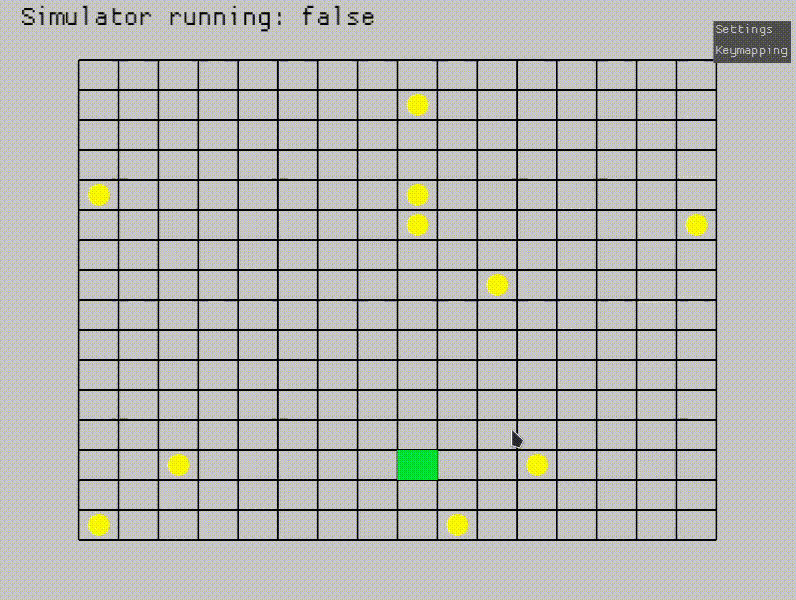

# MASim

Multi-agent system simulator (MASim). Allow users to create and configure environments, place agents in those environments, and observe how they interact or evolve over time.

## Table of content:

- [Installation](#installation)
- [Usage](#usage)
- [Examples](#examples)

## Installation

1. **Install [Rust](https://www.rust-lang.org/fr/tools/install)**

2. **Clone the repo:**

```sh
git clone https://github.com/JoyousOne/MASim.git
cd MASim
```

3. **Dependencies**: Will be automatically installed when running cargo. To consult the dependencies, see [Cargo.toml](/Cargo.toml).

## Usage

1. **In `src/playground` add the file you want to play with.**

2. **Import in `src/main.rs` and tinker with it as you which.**

3. **Build & Run**:

```sh
cargo run
```

## Examples

### Runner

In this example, runners spawn in random positions. Their objective is to reach the `goal`, which is represented by a green cell. They start with a trained Q-table, after which they continue learning independently.


